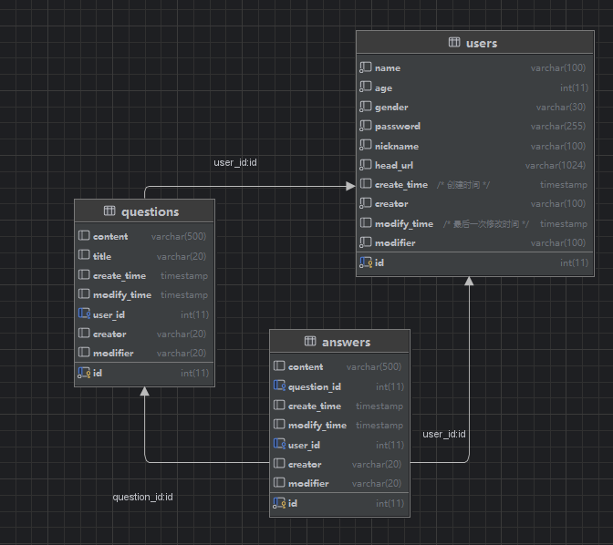

# 介绍

这是以github上的一个开源框架为基础，并借助了ai的帮助，由我开发的用户管理系统+问答系统。

本项目支持docker部署！

## 用户管理系统
实现了基于session会话机制的用户登录系统。注册时在mysql中存放用户名和密码。
以后每次登录，服务端都会保存一个最新session会话存放于redis缓存，同时客户端保存为cookie，这个session有过期时间。以后每次登录，都会更新这个session。

实现了用于对请求进行身份验证的中间件函数`AuthMiddleWare`，在使用本系统的其他所有服务，如用户信息请求，访问问答系统时，都需要经过这个中间件进行
鉴权，鉴权成功才能访问。

实现了用户登出功能。当客户端请求登出，会在服务端删除redis中的session，这样客户端的cookie就失效了，需要重新登录。

## 问答系统
没什么好说的，都是对问题和回答的增删改查

## 数据库设计
### mysql负责存放三张表：
1. 用户（users）：存放用户信息和密码
   - 主键：用户id
2. 问题（questions）：存放问题
   - 主键：回答id
   - 外键：用户id、
3. 回答（answers）：存放回答
   - 主键：回答id
   - 外键：问题id、用户id

即问题与回答之间是一对多的关系
问题与用户、回答与用户是一对一的关系

## 系统架构设计/设计模式
1. 采用了分层解耦的思想。采用传统web开发的分层架构，主要分为controller、service、dao三层。使得代码功能之间的耦合度减小，每一层代码只服务于
特定的功能，增加了代码的可维护性。
2. 实现了基于session会话机制的用户登录系统。用户不用每次都输入密码，且redis读写速度快。优化了用户体验。
3. 实现了单例设计模式。将所有的配置信息都放在配置文件中，通过`sync.Once`来保证并发安全，同时确保配置信息、数据库连接只会被初始化一次。
4. 介入了llama ai，用flask框架写了一个服务器，与本项目之间通过restfulapi通信。

## 带改进
1. 没有体现依赖注入的思想